---
## Front matter
title: "Лабораторная работа №2. Система контроля версий Git"
subtitle: ""
author: "Павленко Сергей"

## Generic otions
lang: ru-RU
toc-title: "Содержание"

## Bibliography
bibliography: bib/cite.bib
csl: pandoc/csl/gost-r-7-0-5-2008-numeric.csl

## Pdf output format
toc: true # Table of contents
toc-depth: 2
lof: true # List of figures
lot: true # List of tables
fontsize: 12pt
linestretch: 1.5
papersize: a4
documentclass: scrreprt
## I18n polyglossia
polyglossia-lang:
  name: russian
  options:
	- spelling=modern
	- babelshorthands=true
polyglossia-otherlangs:
  name: english
## I18n babel
babel-lang: russian
babel-otherlangs: english
## Fonts
mainfont: PT Serif
romanfont: PT Serif
sansfont: PT Sans
monofont: PT Mono
mainfontoptions: Ligatures=TeX
romanfontoptions: Ligatures=TeX
sansfontoptions: Ligatures=TeX,Scale=MatchLowercase
monofontoptions: Scale=MatchLowercase,Scale=0.9
## Biblatex
biblatex: true
biblio-style: "gost-numeric"
biblatexoptions:
  - parentracker=true
  - backend=biber
  - hyperref=auto
  - language=auto
  - autolang=other*
  - citestyle=gost-numeric
## Pandoc-crossref LaTeX customization
figureTitle: "Рис."
tableTitle: "Таблица"
listingTitle: "Листинг"
lofTitle: "Список иллюстраций"
lotTitle: "Список таблиц"
lolTitle: "Листинги"
## Misc options
indent: true
header-includes:
  - \usepackage{indentfirst}
  - \usepackage{float} # keep figures where there are in the text
  - \floatplacement{figure}{H} # keep figures where there are in the text
---

# Цель работы

Целью работы является изучить идеологию и применение средств контроля версий. Приобрести практические навыки по работе с системой git.

# Теоретическое введение
Системы контроля версий (Version Control System, VCS) применяются при работе нескольких человек над одним проектом. Обычно основное дерево проекта хранится в локальном или удалённом репозитории, к которому настроен доступ для участников проекта. При внесении изменений в содержание проекта система контроля версий позволяет их фиксировать, совмещать изменения, произведённые разными участниками проекта, производить откат к любой более ранней версии проекта, если это требуется. В классических системах контроля версий используется централизованная модель, предполагающая наличие единого репозитория для хранения файлов. Выполнение большинства функций по управлению версиями осуществляется специальным сервером. Участник проекта (пользователь) перед началом работы посредством определённых команд получает нужную ему версию файлов. После внесения изменений, пользователь размещает новую версию в хранилище. При этом предыдущие версии не удаляются из центрального хранилища и к ним можно вернуться в любой момент. Сервер может сохранять не полную версию изменённых файлов, а производить так называемую дельта-компрессию — сохранять только изменения между последовательными версиями, что позволяет уменьшить объём хранимых данных. Системы контроля версий поддерживают возможность отслеживания и разрешения конфликтов, которые могут возникнуть при работе нескольких человек над одним файлом. Можно объединить (слить) изменения, сделанные разными участниками (автоматически или вручную), вручную выбрать нужную версию, отменить изменения вовсе или заблокировать файлы для изменения. В зависимости от настроек блокировка не позволяет другим пользователям получить рабочую копию или препятствует изменению рабочей копии файла средствами файловой системы ОС, обеспечивая таким образом, привилегированный доступ только одному пользователю, работающему с файлом. Демидова А. В. 14 Архитектура ЭВМ Системы контроля версий также могут обеспечивать дополнительные, более гибкие функциональные возможности. Например, они могут поддерживать работу с несколькими версиями одного файла, сохраняя общую историю изменений до точки ветвления версий и собственные истории изменений каждой ветви. Кроме того, обычно доступна информация о том, кто из участников, когда и какие изменения вносил. Обычно такого рода информация хранится в журнале изменений, доступ к которому можно ограничить. В отличие от классических, в распределённых системах контроля версий центральный репозиторий не является обязательным. Среди классических VCS наиболее известны CVS, Subversion, а среди распределённых — Git, Bazaar, Mercurial. Принципы их работы схожи, отличаются они в основном синтаксисом используемых в работе команд.

#   Выполнение лабораторной работы
    1. Создайте учётную запись на github.com
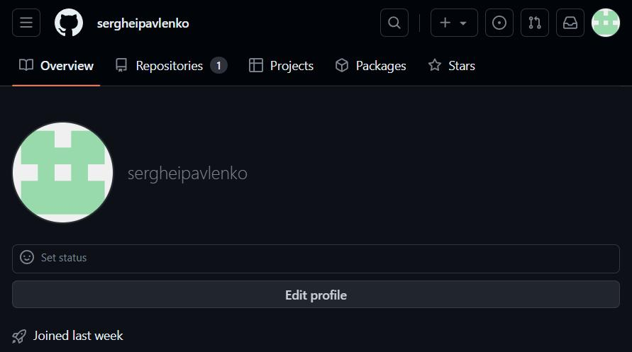{#fig:001 width=70%}

    2. Базовая настройка git
Сделаем предварительную конфигурацию git.
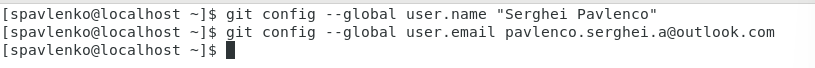{#fig:001 width=70%}

Настроим utf-8 в выводе сообщений git:
{#fig:001 width=70%}

Зададим имя начальной ветки (будем называть её master):
{#fig:001 width=70%}
	
Параметр autocrlf:
{#fig:001 width=70%}

Параметр safecrlf:
{#fig:001 width=70%}

Создание SSH ключа
	Для последующей идентификации пользователя на сервере репозиториев необходимо сгенерировать пару ключей (приватный и открытый): 
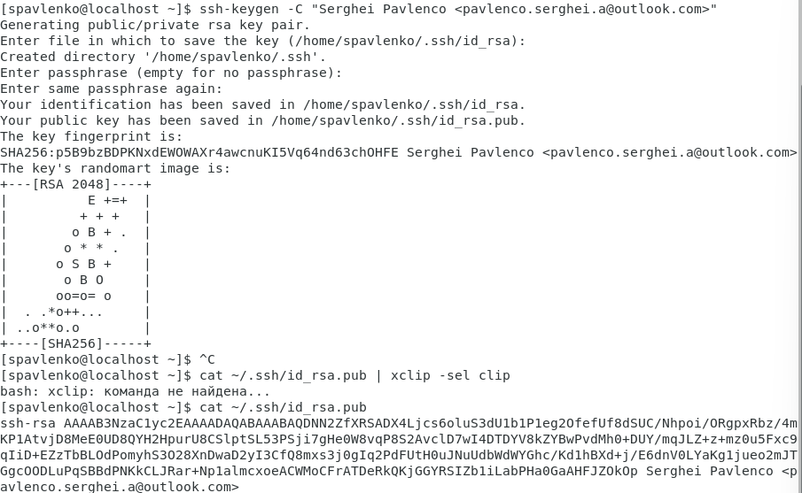{#fig:001 width=70%}

Создали SSH ключ 
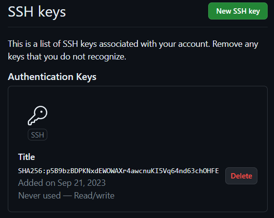{#fig:001 width=70%}

Сознание рабочего пространства и репозитория курса на основе шаблона
Откройте терминал и создайте каталог для предмета «Архитектура компьютера»:
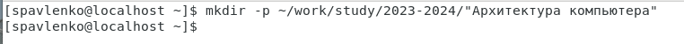{#fig:001 width=70%}

Создали каталог для предмета «Архитектура компьютера»

Сознание репозитория курса на основе шаблона
Репозиторий на основе шаблона можно создать через web-интерфейс github. 
Перейдём на станицу репозитория с шаблоном курса https://github.com/yamadharma/cour se-directory-student-template. Далее выберите Use this template.
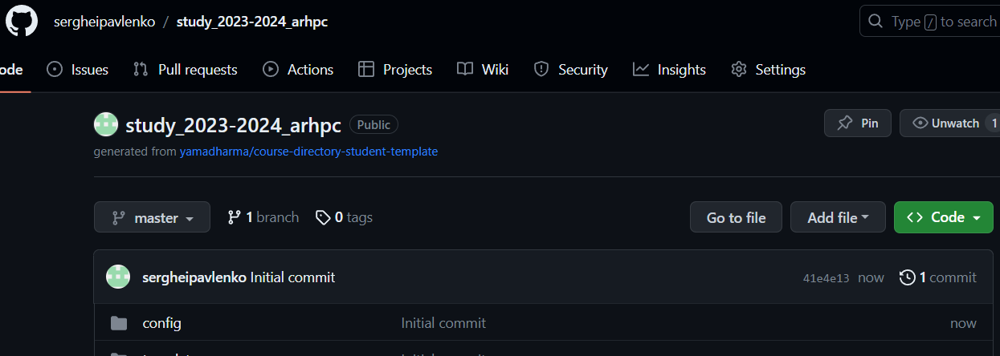{#fig:001 width=70%}

Создали репозиторий по шаблону
В открывшемся окне задали имя репозитория study_2023–2024_arhpc и создали репозиторий (from template). Откроем терминал и перейдём в каталог курса:
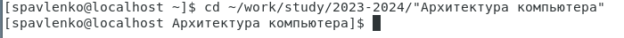{#fig:001 width=70%}

Клонируем созданный репозиторий:
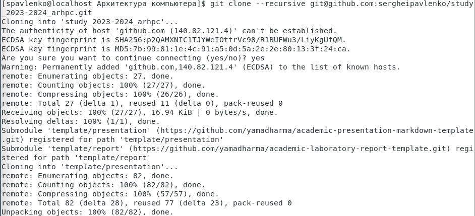{#fig:001 width=70%}

Настройка каталога курса
Перейдём в каталог 	курса:
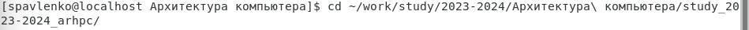{#fig:001 width=70%}

Удалим лишние файлы:
{#fig:001 width=70%}

Создадим необходимые каталоги:
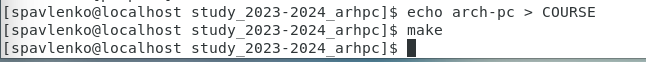{#fig:001 width=70%}

Отправим файлы на сервер:
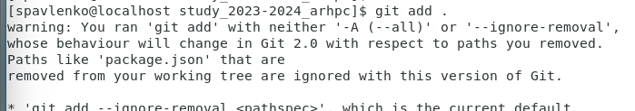{#fig:001 width=70%}

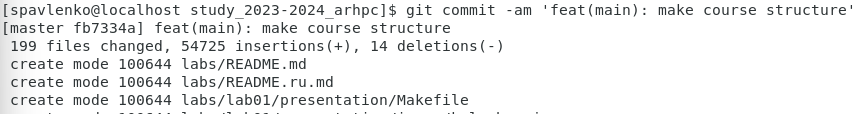{#fig:001 width=70%}

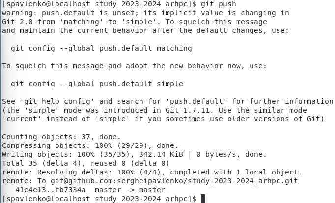{#fig:001 width=70%}

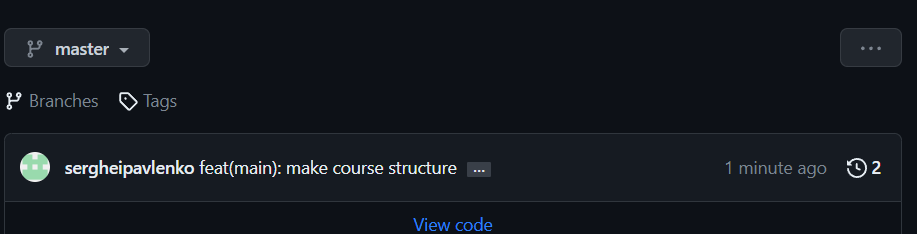{#fig:001 width=70%}

# Задание для самостоятельной работы
    1. Создайте отчет по выполнению лабораторной работы в соответствующем каталоге рабочего пространства (labs>lab02>report).
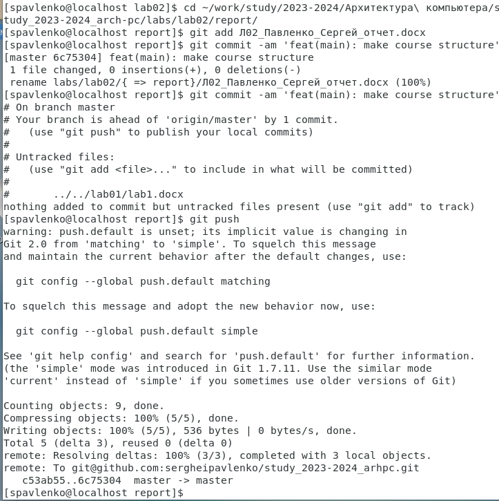{#fig:001 width=70%}

    2. Скопируйте отчеты по выполнению предыдущих лабораторных работ в
соответствующие каталоги созданного рабочего пространства и загрузите файлы на
github.
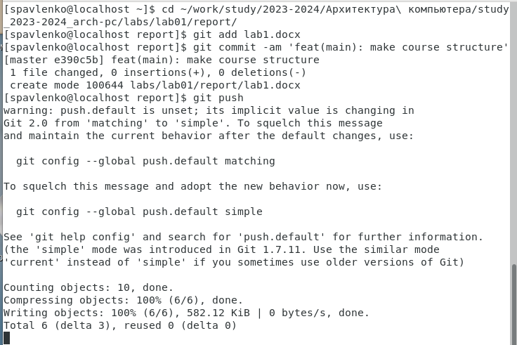{#fig:001 width=70%}

Отчёты по лабораторным работам, находящийхся по адресу ~/labs/lab02/report и
~/labs/lab01/report, отправили в репозиторий и сохранили их в соответствующим им
директориям

# Выводы

В самостоятельной работе мы выполнили работу по сохранению
отчетов в репозиторий github.com, с помощью соответствующих команд в
Terminal

# Список литературы{.unnumbered}

