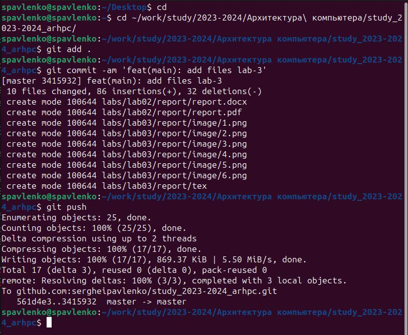

---
## Front matter
title: "ОТЧЕТ по лабораторной работе № 3"
subtitle: "на тему Язык разметки Markdown"
author: "Павленко Сергей"

## Generic otions
lang: ru-RU
toc-title: "Содержание"

## Bibliography
bibliography: bib/cite.bib
csl: pandoc/csl/gost-r-7-0-5-2008-numeric.csl

## Pdf output format
toc: true # Table of contents
toc-depth: 2
lof: true # List of figures
lot: true # List of tables
fontsize: 12pt
linestretch: 1.5
papersize: a4
documentclass: scrreprt
## I18n polyglossia
polyglossia-lang:
  name: russian
  options:
	- spelling=modern
	- babelshorthands=true
polyglossia-otherlangs:
  name: english
## I18n babel
babel-lang: russian
babel-otherlangs: english
## Fonts
mainfont: PT Serif
romanfont: PT Serif
sansfont: PT Sans
monofont: PT Mono
mainfontoptions: Ligatures=TeX
romanfontoptions: Ligatures=TeX
sansfontoptions: Ligatures=TeX,Scale=MatchLowercase
monofontoptions: Scale=MatchLowercase,Scale=0.9
## Biblatex
biblatex: true
biblio-style: "gost-numeric"
biblatexoptions:
  - parentracker=true
  - backend=biber
  - hyperref=auto
  - language=auto
  - autolang=other*
  - citestyle=gost-numeric
## Pandoc-crossref LaTeX customization
figureTitle: "Рис."
tableTitle: "Таблица"
listingTitle: "Листинг"
lofTitle: "Список иллюстраций"
lotTitle: "Список таблиц"
lolTitle: "Листинги"
## Misc options
indent: true
header-includes:
  - \usepackage{indentfirst}
  - \usepackage{float} # keep figures where there are in the text
  - \floatplacement{figure}{H} # keep figures where there are in the text
---

# Цель работы

Освоение процедуры оформления отчетов с помощью легковесного языка разметки Markdown.

# Теоретическое введение

Базовые сведения о Markdown 
Чтобы создать заголовок, используйте знак #, например: 
# This is heading 1 
## This is heading 2 
### This is heading 3 
#### This is heading 4 
Чтобы задать для текста полужирное начертание, заключите его в двойные звездочки: 
This text is **bold**. 
Чтобы задать для текста курсивное начертание, заключите его в одинарные звездочки: 
This text is *italic*. 
Чтобы задать для текста полужирное и курсивное начертание, заключите его в тройные звездочки: 
This is text is both ***bold and italic***. 
Блоки цитирования создаются с помощью символа >: 
> The drought had lasted now for ten million years, and the reign of the 
↪ terrible lizards had long since ended. Here on the Equator, in the 
↪ continent which would one day be known as Africa, the battle for existence 
↪ had reached a new climax of ferocity, and the victor was not yet in sight. 
↪ In this barren and desiccated land, only the small or the swift or the 
↪ fierce could flourish, or even hope to survive. 
Упорядоченный список можно отформатировать с помощью соответствующих цифр: 
1. First instruction 
1. Sub-instruction 
1. Sub-instruction 
1. Second instruction 
Чтобы вложить один список в другой, добавьте отступ для элементов дочернего списка: 
1. First instruction 
1. Second instruction 
1. Third instruction 
Неупорядоченный (маркированный) список можно отформатировать с помощью звездочек или тире: 
* List item 1 
* List item 2 
* List item 3 
Чтобы вложить один список в другой, добавьте отступ для элементов дочернего списка:
- List item 1 
- List item A 
- List item B 
- List item 2 
Синтаксис Markdown для встроенной ссылки состоит из части [link text], представляющей текст гиперссылки, и части (file-name.md) – URL-адреса или имени файла, на который дается ссылка: 
[link text](file-name.md) 
или 
[link text](http://example.com/ "Необязательная подсказка") 
Markdown поддерживает как встраивание фрагментов кода в предложение, так и их размещение между предложениями в виде отдельных огражденных блоков. Огражденные блоки кода — это простой способ выделить синтаксис для фрагментов кода. Общий формат огражденных блоков кода: ``` language 
your code goes in here
 ```
 
# Выполнение лабораторной работы

Перейдите в каталог курса сформированный при выполнении лабораторной работы №2:
cd ~/work/study/2023-2024/”Архитектура компьютера”/arch-pc/ и обновите локальный репозиторий, скачав изменения из удаленного репозитория с помощью команды git pull {#fig:001 width=70%}

Перейдите в каталог с шаблоном отчета по лабораторной работе № 3 cd ~/work/study/2023-2024/"Архитектура компьютера"/arch-pc/labs/lab03/report {#fig:001 width=70%}

Проведите компиляцию шаблона с использованием Makefile. Для этого введите команду make {#fig:001 width=70%}

Удалите полученный файлы с использованием Makefile. Для этого введите команду make clean {#fig:001 width=70%}

Откройте файл report.md c помощью любого текстового редактора, например gedit gedit report.md {#fig:001 width=70%} 
{#fig:001 width=70%} 

Заполните отчет и скомпилируйте отчет с использованием Makefile. Проверьте корректность полученных файлов. (Обратите внимание, для корректного отображения скриншотов они должны быть размещены в каталоге image) 
{#fig:001 width=70%} 
# Вывод

Таким образом мы научились создавать отчеты в системе Markdown и получать отчеты в виде .pdf , md. и .docx

# Задание для самостоятельной работы 
1. В соответствующем каталоге сделайте отчёт по лабораторной работе № 2 в формате Markdown. В качестве отчёта необходимо предоставить отчёты в 3 форматах: pdf, docx и md. {#fig:001 width=70%} 

2. Загрузите файлы на github.{#fig:001 width=70%} 

# Выводы
В ходе лабораторной мы научились создавать отчеты в системе Markdown и получать отчеты в виде .pdf , md. и .docx


# Список литературы{.unnumbered}

Список литературы 
1. GDB: The GNU Project Debugger. — URL: https://www.gnu.org/software/gdb/. 
2. GNU Bash Manual. — 2016. — URL: https://www.gnu.org/software/bash/manual/. 
3. Midnight Commander Development Center. — 2021. — URL: https://midnight-commander. org/. 
4. NASM Assembly Language Tutorials. — 2021. — URL: https://asmtutor.com/. 
5. Newham C. Learning the bash Shell: Unix Shell Programming. — O’Reilly Media, 2005. — 354 с. — (In a Nutshell). — ISBN 0596009658. — URL: http://www.amazon.com/Learningbash-Shell-Programming-Nutshell/dp/0596009658. 
6. Robbins A. Bash Pocket Reference. — O’Reilly Media, 2016. — 156 с. — ISBN 978-1491941591. 
7. The NASM documentation. — 2021. — URL: https://www.nasm.us/docs.php. 
8. Zarrelli G. Mastering Bash. — Packt Publishing, 2017. — 502 с. — ISBN 9781784396879. 
9. Колдаев В. Д., Лупин С. А. Архитектура ЭВМ. — М. : Форум, 2018. 
10. Куляс О. Л., Никитин К. А. Курс программирования на ASSEMBLER. — М. : Солон-Пресс, 2017. 
11. Новожилов О. П. Архитектура ЭВМ и систем. — М. : Юрайт, 2016. 
12. Расширенный ассемблер: NASM. — 2021. — URL: https://www.opennet.ru/docs/RUS/nasm/. 
13. Робачевский А., Немнюгин С., Стесик О. Операционная система UNIX. — 2-е изд. — БХВПетербург, 2010. — 656 с. — ISBN 978-5-94157-538-1. 
14. Столяров А. Программирование на языке ассемблера NASM для ОС Unix. — 2-е изд. — М. : МАКС Пресс, 2011. — URL: http://www.stolyarov.info/books/asm_unix. 
15. Таненбаум Э. Архитектура компьютера. — 6-е изд. — СПб. : Питер, 2013. — 874 с. — (Классика Computer Science). 
16. Таненбаум Э., Бос Х. Современные операционные системы. — 4-е изд. — СПб. : Питер, 2015. — 1120 с. — (Классика Computer Science).

