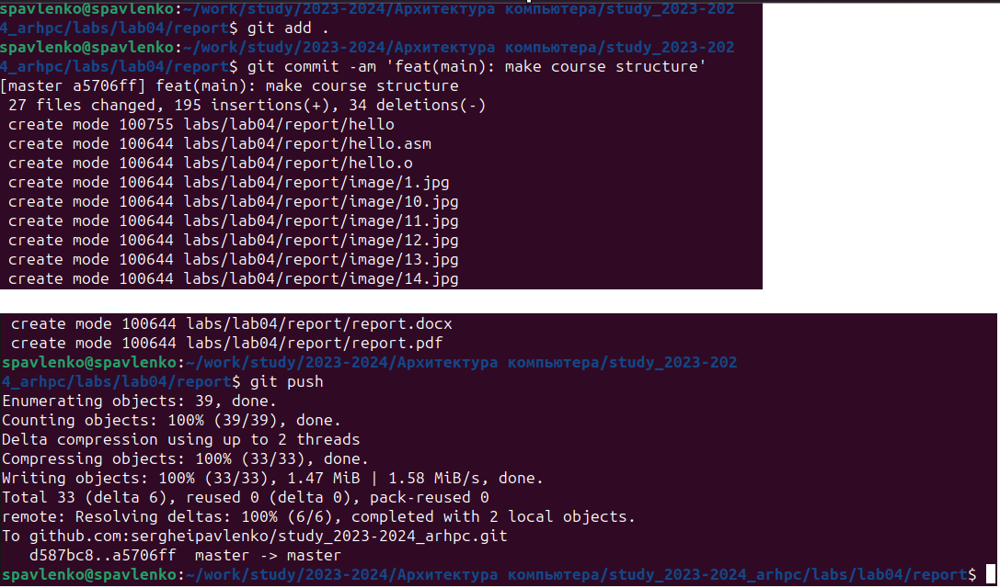

---
## Front matter
title: "Лабораторная работа №4"
subtitle: "Создание и процесс обработки программ на языке ассемблер NASM"
author: "Павленко Сергей"

## Generic otions
lang: ru-RU
toc-title: "Содержание"

## Bibliography
bibliography: bib/cite.bib
csl: pandoc/csl/gost-r-7-0-5-2008-numeric.csl

## Pdf output format
toc: true # Table of contents
toc-depth: 2
lof: true # List of figures
lot: true # List of tables
fontsize: 12pt
linestretch: 1.5
papersize: a4
documentclass: scrreprt
## I18n polyglossia
polyglossia-lang:
  name: russian
  options:
	- spelling=modern
	- babelshorthands=true
polyglossia-otherlangs:
  name: english
## I18n babel
babel-lang: russian
babel-otherlangs: english
## Fonts
mainfont: PT Serif
romanfont: PT Serif
sansfont: PT Sans
monofont: PT Mono
mainfontoptions: Ligatures=TeX
romanfontoptions: Ligatures=TeX
sansfontoptions: Ligatures=TeX,Scale=MatchLowercase
monofontoptions: Scale=MatchLowercase,Scale=0.9
## Biblatex
biblatex: true
biblio-style: "gost-numeric"
biblatexoptions:
  - parentracker=true
  - backend=biber
  - hyperref=auto
  - language=auto
  - autolang=other*
  - citestyle=gost-numeric
## Pandoc-crossref LaTeX customization
figureTitle: "Рис."
tableTitle: "Таблица"
listingTitle: "Листинг"
lofTitle: "Список иллюстраций"
lotTitle: "Список таблиц"
lolTitle: "Листинги"
## Misc options
indent: true
header-includes:
  - \usepackage{indentfirst}
  - \usepackage{float} # keep figures where there are in the text
  - \floatplacement{figure}{H} # keep figures where there are in the text
---

# Цель работы

Освоение процедуры компиляции и сборки программ, написанных на ассемблере NASM

# Теоретическое введение

Основные принципы работы компьютера
    Основными функциональными элементами электронно-вычислительной машины являются центральный процессор, память и периферийные устройства
    Взаимодействие этих устройств осуществляется через общую шину, к которой они подключены. Физически шина представляет собой большое количество проводников, соединяющий устройства друг с другом. В современных компьютерах проводники выполнены в виде электропроводящих дорожек на материнской плате.
    Основной задачей процессора является обработка информации, а также организация координации всех узлов компьютера. В состав центрального процессора входят следующие устройства:
* List item 1 арифметико-логическое устройство (АЛУ) - выполняет логические и арифметические действия, необходимые для обработки информации, хранящиейся в памяти
* List item 2 устройство управления (УУ) - обеспечивает управление и контроль всех устройств компьютера
* List item 3 регистры - свехбыстрая оперативная память небольшого объёма, входящая в состав процессора, для временного хранения промежуточных результатов выполнения инструкций. Регистры процессора делятся на два типа: регистры общего назначения и специальные регистры

    Для того, чтобы писаь программы на ассембере, необходимо знать, какие регистры процессора существуют и как их можно использовать. Большинство команд в программах написанных на пссемблере используют регистры в качестве операндов. Практически все команды представляют собой преобразование данных хранящихся в регистрах процессора, это например пересылка данных между регистрами или между регистрами и памятью, преобразование данных хранящихся в регистрах.
    Доступ к регистрам осуществляется не по адресам, как к основной памяти, а по именам. Каждый регистр процессора архитектуры х86 имеет свое название, состоящее из 2 или 3 букв латинского алфавита.
    В качестве примера приведем названия основных регистров общего назначения:
    
    * List item 1 RAX, RCX, RDX, RBX, RSI, RDI - 64 битные
    * List item 2 EAX, ECX, EDX, EBX, ESI, EDI - 32 битные
    * List item 3 AX, CX, DX, BX, SI, DI - 16 битные
    * List item 4 AH, AL, CH, CL, DH, DL, BH, BL - 8 битные

    Таким образом можно отметить, что вы можете написать в своей программе, например, такие команды:

mov    ax, 1
mov    eax, 1

    Обе команды поместят в регистр АХ число 1. Разница будет заключатся только в том, что вторая команда обнулит старшие разряды регистра EAX, то есть после выполнения второй команды в регистре EAX будет число 1. А первая команда оставит в старших разрядах регистра EAX старые данные. И если там были данные, отличные от нуля, то после выполнения первой команды в регистре EAX будет какое-то число, но не 1. А вот в регистре AX будет число 1.
    Другим важным узлом ЭВМ является оперативное запоминающее устройство (ОЗУ). ОЗУ — это быстродействующее энергозависимое запоминающее устройство, которое на- прямую взаимодействует с узлами процессора, предназначенное для хранения программ и данных, с которыми процессор непосредственно работает в текущий момент. ОЗУ состоит из одинаковых пронумерованных ячеек памяти. Номер ячейки памяти — это адрес хранящихся в ней данных.

# Выполнение лабораторной работы

    Перейдём в каталог
cd ~/work/arch-pc/lab04
    Создадим текстовый файл с именем hello.asm
touch hello.asm
    Откроем этот файл с помощью любого текстового редактора, например, gedit
gedit hello.asm

{#fig:fig1 width=70%}

    Введём в него следующий текст

{#fig:fig2 width=70%}

    NASM превращает текст программы в объектный код. Например, для компиляции приведённого выше текста программы «Hello World» необходимо написать:
nasm -f elf hello.asm 
    Если текст программы набран без ошибок, то транслятор преобразует текст программы из файла hello.asm в объектный код, который запишется в файл hello.o.
    С помощью команды ls проверим, что объектный файл был создан.
    
{#fig:fig3 width=70%}

    Выполним следующую команду:
nasm -o obj.o -f elf -g -l list.lst hello.asm
    Спомощью команды ls проверим, что файлы были созданы
    
{#fig:fig4 width=70%}

    Как видно из схемы на пред. рис., чтобы получить исполняемую программу, объектный файл
необходимо передать на обработку компоновщику:
ld -m elf_i386 hello.o -o hello
    Спомощью команды ls проверим, что файлы были созданы
    
{#fig:fig5 width=70%}

    Ключ -o с последующим значением задаёт в данном случае имя создаваемого исполняемого файла.
    Выполните следующую команду
ld -m elf_i386 obj.o -o main

{#fig:fig6 width=70%}

    Спомощью команды ls проверим, какое имя имеет объектный файл
    
{#fig:fig7 width=70%}

    Запустим на выполнение созданный исполняемый файл, находящийся в текущем каталоге, можно, набрав в командной строке:
./hello

{#fig:fig8 width=70%}

# Выводы

    Выполнив данную лабораторную работу мы понили, как можно пользоваться простейшими программами на языке ассемблера NASM, выяснили как преобразовывать файлы *.аsm в файлы *.о, как компилировать код программы, как передать файл на обработку компоновщику и как запустить исходный файл.

# Выполнение лабораторной работы

1.   В каталоге ~/work/arch-pc/lab04 с помощью команды cp создим копию файла
hello.asm с именем lab4.asm

{#fig:fig9 width=70%}

2. С помощью любого текстового редактора внесите изменения в текст программы в файле lab4.asm так, чтобы вместо Hello world! на экран выводилась строка с вашими фамилией и именем.

{#fig:fig10 width=70%}

3. Оттранслируйте полученный текст программы lab4.asm в объектный файл.

{#fig:fig11 width=70%}

Выполним компоновку объектного файла 

{#fig:fig12 width=70%}

Запустите получившийся исполняемый файл.

{#fig:fig13 width=70%}

4. Скопируйте файлы hello.asm и lab4.asm в Ваш локальный репозиторий в каталог ~/work/study/2023-2024/"Архитектура компьютера"/arch-pc/labs/lab04/.
Загрузите файлы на Github

{#fig:fig14 width=70%}

# Выводы по самостоятельной работы

С помощью данных заданий, мы на практике закрепили пройденный материал: по преобразовыванию файлов, компилированию кода, по передаче файла на обработку и запустили исходный файл.

# Список литературы{.unnumbered}
1. GDB: The GNU Project Debugger. — URL: https://  www.gnu.org/software/gdb/.
2. GNU Bash Manual. — 2016. — URL: https://www.gnu.org/software/bash/manual/.
3. Midnight Commander Development Center. — 2021. — URL: https://midnight-commander.
org/.
4. NASM Assembly Language Tutorials. — 2021. — URL: https://asmtutor.com/.
5. Newham C. Learning the bash Shell: Unix Shell Programming. — O’Reilly Media, 2005. —
354 с. — (In a Nutshell). — ISBN 0596009658. — URL: http://www.amazon.com/Learning-
bash-Shell-Programming-Nutshell/dp/0596009658.
6. Robbins A. Bash Pocket Reference. — O’Reilly Media, 2016. — 156 с. — ISBN 978-1491941591.
7. The NASM documentation. — 2021. — URL: https://www.nasm.us/docs.php.
8. Zarrelli G. Mastering Bash. — Packt Publishing, 2017. — 502 с. — ISBN 9781784396879.
9. Колдаев В. Д., Лупин С. А. Архитектура ЭВМ. — М. : Форум, 2018.
10. Куляс О. Л., Никитин К. А. Курс программирования на ASSEMBLER. — М. : Солон-Пресс,
2017.
11. Новожилов О. П. Архитектура ЭВМ и систем. — М. : Юрайт, 2016.
12. Расширенный ассемблер: NASM. — 2021. — URL: https://www.opennet.ru/docs/RUS/nasm/.
13. Робачевский А., Немнюгин С., Стесик О. Операционная система UNIX. — 2-е изд. — БХВ-
Петербург, 2010. — 656 с. — ISBN 978-5-94157-538-1.
14. Столяров А. Программирование на языке ассемблера NASM для ОС Unix. — 2-е изд. —
М. : МАКС Пресс, 2011. — URL: http://www.stolyarov.info/books/asm_unix.
15. Таненбаум Э. Архитектура компьютера. — 6-е изд. — СПб. : Питер, 2013. — 874 с. — (Классика Computer Science).
16. Таненбаум Э., Бос Х. Современные операционные системы. — 4-е изд. — СПб. : Питер, 2015. — 1120 с. — (Классика Computer Science

