---
## Front matter
title: "Лабораторная работа №5. Основы работы Midnight Commander. Структура программы на языке ассемблера. Системные вызовы в ОС Linux отчёта по лабораторной работе"
subtitle: "Отчёт по лабораторной работе"
author: "Павленко Сергей"

## Generic otions
lang: ru-RU
toc-title: "Содержание"

## Bibliography
bibliography: bib/cite.bib
csl: pandoc/csl/gost-r-7-0-5-2008-numeric.csl

## Pdf output format
toc: true # Table of contents
toc-depth: 2
lof: true # List of figures
lot: true # List of tables
fontsize: 12pt
linestretch: 1.5
papersize: a4
documentclass: scrreprt
## I18n polyglossia
polyglossia-lang:
  name: russian
  options:
	- spelling=modern
	- babelshorthands=true
polyglossia-otherlangs:
  name: english
## I18n babel
babel-lang: russian
babel-otherlangs: english
## Fonts
mainfont: PT Serif
romanfont: PT Serif
sansfont: PT Sans
monofont: PT Mono
mainfontoptions: Ligatures=TeX
romanfontoptions: Ligatures=TeX
sansfontoptions: Ligatures=TeX,Scale=MatchLowercase
monofontoptions: Scale=MatchLowercase,Scale=0.9
## Biblatex
biblatex: true
biblio-style: "gost-numeric"
biblatexoptions:
  - parentracker=true
  - backend=biber
  - hyperref=auto
  - language=auto
  - autolang=other*
  - citestyle=gost-numeric
## Pandoc-crossref LaTeX customization
figureTitle: "Рис."
tableTitle: "Таблица"
listingTitle: "Листинг"
lofTitle: "Список иллюстраций"
lotTitle: "Список таблиц"
lolTitle: "Листинги"
## Misc options
indent: true
header-includes:
  - \usepackage{indentfirst}
  - \usepackage{float} # keep figures where there are in the text
  - \floatplacement{figure}{H} # keep figures where there are in the text
---

# Цель работы

Приобретение практических навыков работы в Midnight Commander. Освоение инструкций
языка ассемблера mov и int.

# Теоретическое введение

Основы работы с Midnight Commander
Midnight Commander (или просто mc) — это программа, которая позволяет просматривать
структуру каталогов и выполнять основные операции по управлению файловой системой,
т.е. mc является файловым менеджером. Midnight Commander позволяет сделать работу с
файлами более удобной и наглядной.
Для активации оболочки Midnight Commander достаточно ввести в командной строке mc и
нажать клавишу Enter 
В Midnight Commander используются функциональные клавиши F1 — F10 , к которым
привязаны часто выполняемые операции 
Дополнительную информацию о Midnight Commander можно получить по команде man
mc и на странице проекта

# Выполнение лабораторной работы

1. Откройте Midnight Commander
user@dk4n31:~$ mc
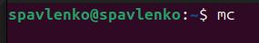{#fig:001 width=70%}

2. Пользуясь клавишами ↑ , ↓ и Enter перейдите в нужный каталог ~/work/arch-pc 
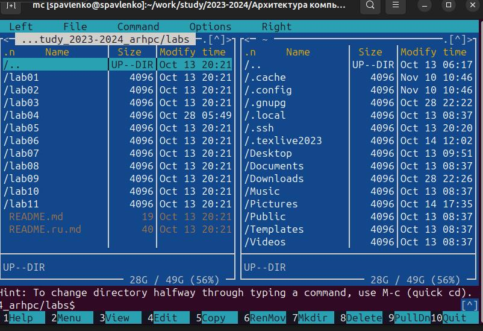{#fig:002 width=70%}

3. Пользуясь строкой ввода и командой touch создайте файл lab5-1.asm
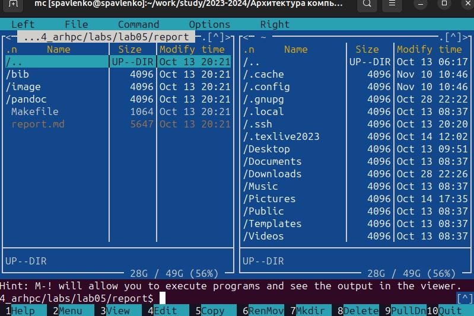{#fig:003 width=70%}

4. С помощью функциональной клавиши F4 откройте файл lab5-1.asm для редактирования во встроенном редакторе. Как правило в качестве встроенного редактора Midnight Commander используется редакторы nano
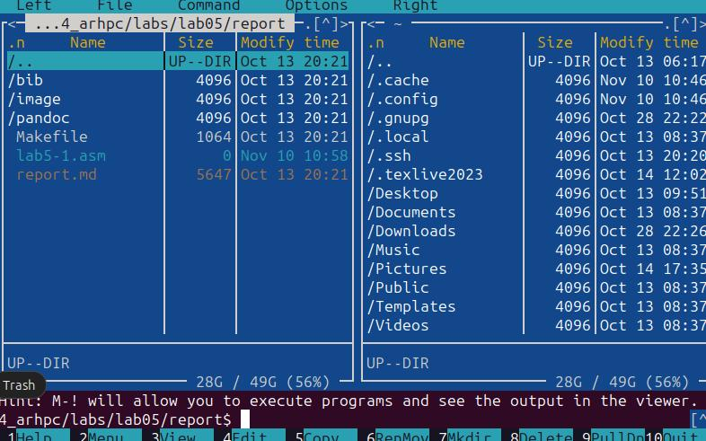{#fig:004 width=70%}

5. Введите текст программы из листинга 5.1 (можно без комментариев), сохраните изменения и закройте файл
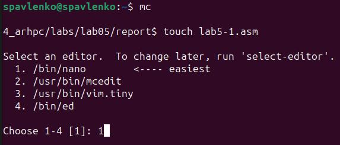{#fig:005 width=70%}

6. С помощью функциональной клавиши F3 откройте файл lab5-1.asm для просмотра.
Убедитесь, что файл содержит текст программы.
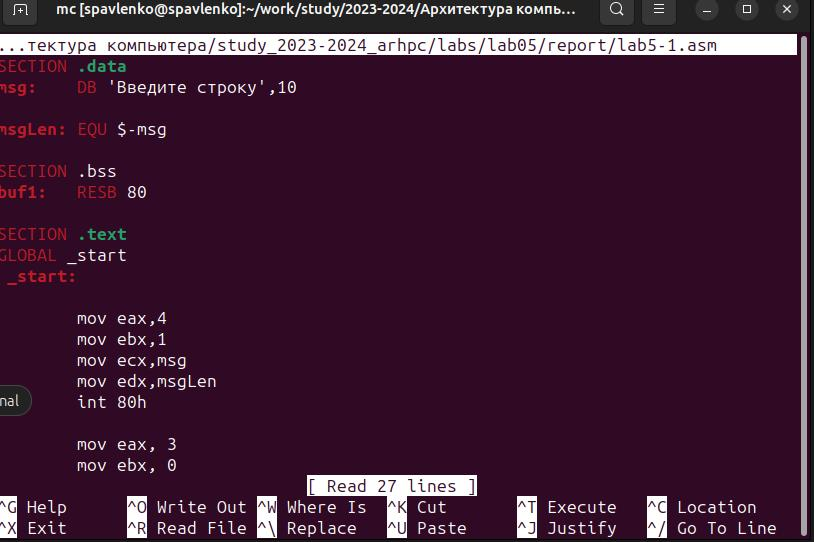{#fig:006 width=70%}

7. Оттранслируйте текст программы lab5-1.asm в объектный файл. Выполните компоновку объектного файла и запустите получившийся исполняемый файл. Программа выводит строку 'Введите строку:' и ожидает ввода с клавиатуры. На запрос введите
Ваши ФИО.
user@dk4n31:~$ nasm -f elf lab5-1.asm
user@dk4n31:~$ ld -m elf_i386 -o lab5-1 lab5-1.o
user@dk4n31:~$ ./lab5-1
Введите строку:
Имя пользователя
user@dk4n31:~$
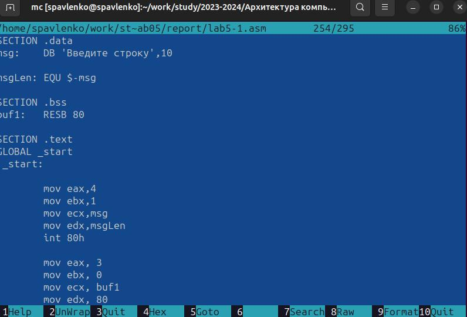{#fig:007 width=70%}

8. Скачайте файл in_out.asm со страницы курса в ТУИС.
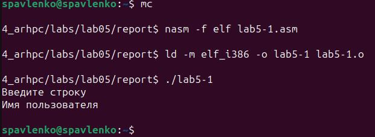{#fig:008 width=70%}

9. Подключаемый файл in_out.asm должен лежать в том же каталоге, что и файл с программой, в которой он используется.
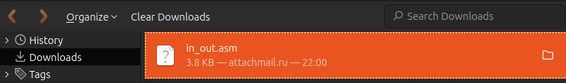{#fig:009 width=70%}
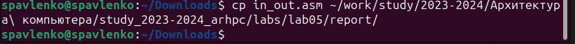{#fig:010 width=70%}

10. С помощью функциональной клавиши F6 создайте копию файла lab5-1.asm с именем lab5-2.asm. Выделите файл lab5-1.asm, нажмите клавишу F6 , введите имя файла lab5-2.asm и нажмите клавишу Enter
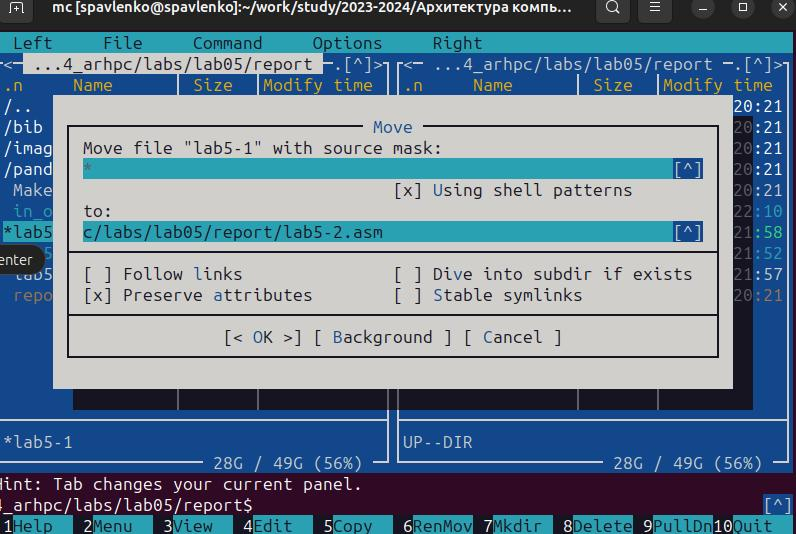{#fig:010 width=70%}

11. Исправьте текст программы в файле lab5-2.asm с использование подпрограмм из внешнего файла in_out.asm (используйте подпрограммы sprintLF, sread и quit) в соответствии с листингом 5.2. Создайте исполняемый файл и проверьте его работу
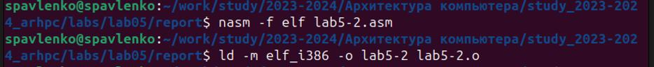{#fig:011 width=70%}

12. В файле lab5-2.asm замените подпрограмму sprintLF на sprint. Создайте исполняемый файл и проверьте его работу. В чем разница?
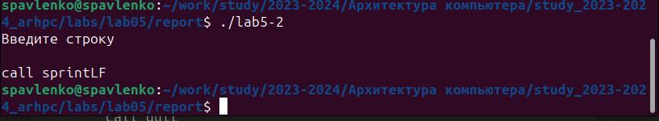{#fig:012 width=70%}

А разница в том, что sprint – вывод сообщения на экран, а
sprintLF – работает аналогично sprint, но при выводе на экран добавляет к сообщению символ перевода строки;

# Выводы

Таким образом, узнали, что мс позволяет просматривать структуры каталогов и выполнять основные операции по управлению файловой системой, а также мы научились базово пользоваться mc, узнали различные структуры программ на языке NASM.

# Задание для самостоятельной работы

1. Создайте копию файла lab5-1.asm. Внесите изменения в программу (без использова-
ния внешнего файла in_out.asm), так чтобы она работала по следующему алгоритму:
• вывести приглашение типа “Введите строку:”;
• ввести строку с клавиатуры;
• вывести введённую строку на экран.
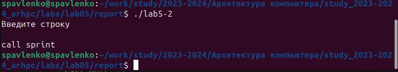{#fig:013 width=70%}
2. Получите исполняемый файл и проверьте его работу. На приглашение ввести строку
введите свою фамилию.
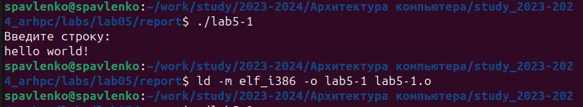{#fig:014 width=70%}
3. Создайте копию файла lab5-2.asm. Исправьте текст программы с использование под-
программ из внешнего файла in_out.asm, так чтобы она работала по следующему
алгоритму:
• вывести приглашение типа “Введите строку:”;
• ввести строку с клавиатуры;
• вывести введённую строку на экран.
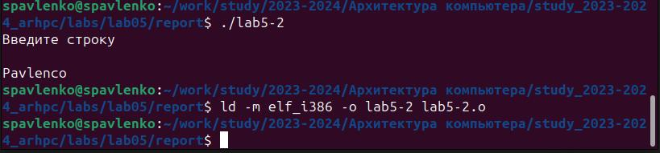{#fig:015 width=70%}

# Выводы 

В ходе лабораторной работы мы выяснили назначение мс, какие операции с файлами можо выполнять с помощью мс, основные структуры ассемблера, какие компоненты и для чего используются в языке ассемблере, итд.

# Список литературы{.unnumbered}

1. GDB: The GNU Project Debugger. — URL: https://www.gnu.org/software/gdb/.
2. GNU Bash Manual. — 2016. — URL: https://www.gnu.org/software/bash/manual/.
3. Midnight Commander Development Center. — 2021. — URL: https://midnight-commander.
org/.
4. NASM Assembly Language Tutorials. — 2021. — URL: https://asmtutor.com/.
5. Newham C. Learning the bash Shell: Unix Shell Programming. — O’Reilly Media, 2005. —
354 с. — (In a Nutshell). — ISBN 0596009658. — URL: http://www.amazon.com/Learning-
bash-Shell-Programming-Nutshell/dp/0596009658.
6. Robbins A. Bash Pocket Reference. — O’Reilly Media, 2016. — 156 с. — ISBN 978-1491941591.
7. The NASM documentation. — 2021. — URL: https://www.nasm.us/docs.php.
8. Zarrelli G. Mastering Bash. — Packt Publishing, 2017. — 502 с. — ISBN 9781784396879.
9. Колдаев В. Д., Лупин С. А. Архитектура ЭВМ. — М. : Форум, 2018.
10. Куляс О. Л., Никитин К. А. Курс программирования на ASSEMBLER. — М. : Солон-Пресс,
2017.
11. Новожилов О. П. Архитектура ЭВМ и систем. — М. : Юрайт, 2016.
12. Расширенный ассемблер: NASM. — 2021. — URL: https://www.opennet.ru/docs/RUS/nasm/.
13. Робачевский А., Немнюгин С., Стесик О. Операционная система UNIX. — 2-е изд. — БХВ-
Петербург, 2010. — 656 с. — ISBN 978-5-94157-538-1.
14. Столяров А. Программирование на языке ассемблера NASM для ОС Unix. — 2-е изд. —
М. : МАКС Пресс, 2011. — URL: http://www.stolyarov.info/books/asm_unix.
15. Таненбаум Э. Архитектура компьютера. — 6-е изд. — СПб. : Питер, 2013. — 874 с. —
(Классика Computer Science).
16. Таненбаум Э., Бос Х. Современные операционные системы. — 4-е изд. — СПб. : Питер,
2015. — 1120 с. — (Классика Computer Science)
