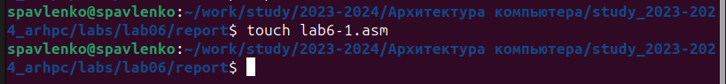
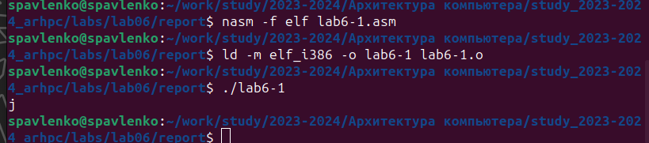
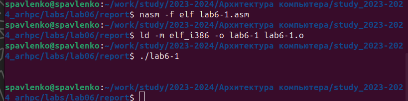
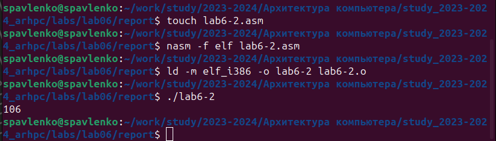
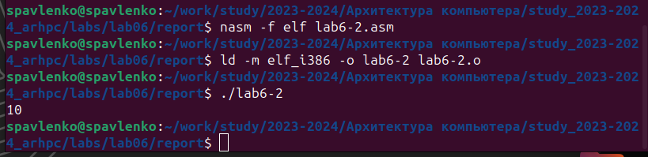
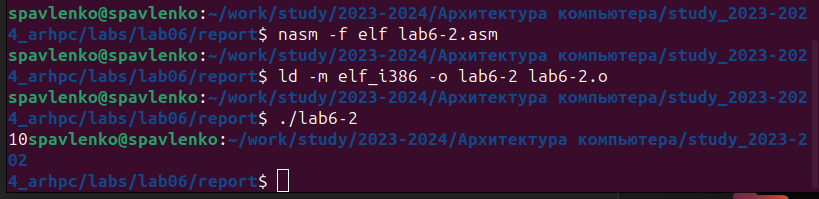
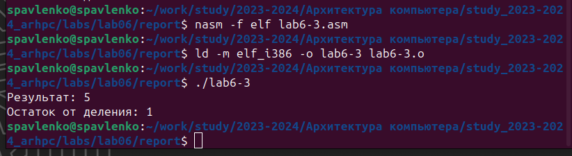
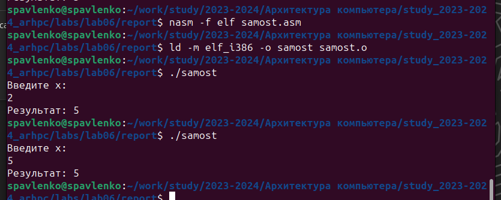

---
## Front matter
title: "Лабораторная работа №6."
subtitle: "Арифметические операции в NASM."
author: "Павленко Сергей"

## Generic otions
lang: ru-RU
toc-title: "Содержание"

## Bibliography
bibliography: bib/cite.bib
csl: pandoc/csl/gost-r-7-0-5-2008-numeric.csl

## Pdf output format
toc: true # Table of contents
toc-depth: 2
lof: true # List of figures
lot: true # List of tables
fontsize: 12pt
linestretch: 1.5
papersize: a4
documentclass: scrreprt
## I18n polyglossia
polyglossia-lang:
  name: russian
  options:
	- spelling=modern
	- babelshorthands=true
polyglossia-otherlangs:
  name: english
## I18n babel
babel-lang: russian
babel-otherlangs: english
## Fonts
mainfont: PT Serif
romanfont: PT Serif
sansfont: PT Sans
monofont: PT Mono
mainfontoptions: Ligatures=TeX
romanfontoptions: Ligatures=TeX
sansfontoptions: Ligatures=TeX,Scale=MatchLowercase
monofontoptions: Scale=MatchLowercase,Scale=0.9
## Biblatex
biblatex: true
biblio-style: "gost-numeric"
biblatexoptions:
  - parentracker=true
  - backend=biber
  - hyperref=auto
  - language=auto
  - autolang=other*
  - citestyle=gost-numeric
## Pandoc-crossref LaTeX customization
figureTitle: "Рис."
tableTitle: "Таблица"
listingTitle: "Листинг"
lofTitle: "Список иллюстраций"
lotTitle: "Список таблиц"
lolTitle: "Листинги"
## Misc options
indent: true
header-includes:
  - \usepackage{indentfirst}
  - \usepackage{float} # keep figures where there are in the text
  - \floatplacement{figure}{H} # keep figures where there are in the text
---

# Цель работы

Освоение арифметических инструкций языка ассемблера NASM.

# Теоретическое введение

    Большинство инструкций на языке ассемблера требуют обработки операндов. Адрес опе-
ранда предоставляет место, где хранятся данные, подлежащие обработке. Это могут быть
данные хранящиеся в регистре или в ячейке памяти. Далее рассмотрены все существующие
способы задания адреса хранения операндов – способы адресации.
Существует три основных способа адресации:
* Регистровая адресация – операнды хранятся в регистрах и в команде используются
имена этих регистров, например: mov ax,bx.
* Непосредственная адресация – значение операнда задается непосредственно в ко-
манде, Например: mov ax,2.
* Адресация памяти – операнд задает адрес в памяти. В команде указывается символи-
ческое обозначение ячейки памяти, над содержимым которой требуется выполнить
операцию.
Например, определим переменную intg DD 3 – это означает, что задается область памяти
размером 4 байта, адрес которой обозначен меткой intg. В таком случае, команда
mov eax,[intg]
копирует из памяти по адресу intg данные в регистр eax. В свою очередь команда
mov [intg],eax
запишет в память по адресу intg данные из регистра eax.
Также рассмотрим команду
mov eax,intg
В этом случае в регистр eax запишется адрес intg. Допустим, для intg выделена память
начиная с ячейки с адресом 0x600144, тогда команда mov eax,intg аналогична команде mov
eax,0x600144 – т.е. эта команда запишет в регистр eax число 0x600144

# Выполнение лабораторной работы

1. Перейдите в каталог для программам лабораторной работы № 6, и создайте файл lab6-1.asm

{#fig:001 width=70%}

2. Создайте исполняемый файл и запустите его. 
nasm -f elf lab6-1.asm 
ld -m elf_i386 -o lab6-1 lab6-1.o 
./lab6-1

{#fig:002 width=70%}

3. Далее изменим текст программы и вместо символов, запишем в регистры числа. Исправьте текст программы следующим образом: замените строки
moveax,'6'
movebx,'4'
на строки
moveax,6
movebx,4

Пользуясь таблицей ASCII, узнаем, что символ с кодом 10 переносит строку

{#fig:003 width=70%}

4. Создайте файл lab6-2.asm в каталоге ~/work/arch-pc/lab06 и введите в него текст программы из листинга 6.2.
touch ~/work/arch-pc/lab06/lab6-2.asm

{#fig:004 width=70%}

5. Аналогично предыдущему примеру изменим символы на числа. Замените строки
moveax,'6'
movebx,'4'
на строки
moveax,6
movebx,4
Создайте исполняемый файл и запустите его. Какой результат будет получен при исполнении программы?

{#fig:005 width=70%}

Замените функцию iprintLF на iprint. Создайте исполняемый файл и запустите его. Чем отличается вывод функций iprintLF и iprint?

{#fig:006 width=70%}

iprint Функция вывода на экран чисел в формате ASCII
iprintLF Функция вывода на экран чисел в формате ASCII с переводом строки

6. Создайте файл lab6-3.asm в каталоге ~/work/arch-pc/lab06: touch ~/work/arch-pc/lab06/lab6-3.asm
Внимательно изучите текст программы из листинга 6.3 и введите в lab6-3.asm.
Создайте исполняемый файл и запустите его.

{#fig:007 width=70%}

Измените текст программы для вычисления выражения f(x) = (4 ∗ 6 + 2) / 5. Создайте исполняемый файл и проверьте его работу.

{#fig:008 width=70%}

7. Создайте файл variant.asm в каталоге ~/work/arch-pc/lab06: touch ~/work/arch-pc/lab06/variant.asm
Внимательно изучите текст программы из листинга 6.4 и введите в файл variant.asm.

{#fig:009 width=70%}

1. Какие строки листинга 6.4 отвечают за вывод на экран сообщения ‘Ваш вариант:’?
mov eax,rem
call sprint

2. Для чего используется следующие инструкции?
mov ecx, x
mov edx, 80
call sread

call sread - Функция считывания сообщения, а ecx, edx - вводные данные
3. Для чего используется инструкция “call atoi”?

Это функция преобразования ascii-код символа в целое число
4. Какие строки листинга 6.4 отвечают за вычисления варианта?

xor edx,edx
mov ebx,20
div ebx
inc edx
5. В какой регистр записывается остаток от деления при выполнении инструкции “div ebx”?

При выполнении инструкции остаток от деления записывается в регистре ebx
6. Для чего используется инструкция “inc edx”?

Данная инструкция используется для увеличения edx на единицу
7. Какие строки листинга 6.4 отвечают за вывод на экран результата вычислений?

mov eax,edx
call iprintLF

# Выводы

Таким образом мы ознакомились с арифметическими инструкциями языка ассемблера NASM и выполнили несколько примеров для закрепления материала

# Задание для самостоятельной работы

Написать программу вычисления выражения y = f(x). Программа должна выводить
выражение для вычисления, выводить запрос на ввод значения x, вычислять заданное выражение в зависимости от введенного x, выводить результат вычислений. Вид
функции f(x) выбрать из таблицы 6.3 вариантов заданий в соответствии с номером
полученным при выполнении лабораторной работы. Создайте исполняемый файл и
проверьте его работу для значений x1 и x2 из 6.3.
6 вариант = (x^3)/2 + 1, при x1=2, x2=5

{#fig:010 width=70%}

# Вывод по самостоятельной работе

Таким образом каждый смог опробывать решить свой индивидуальный вариант задания, связанное с решением арифметического произведения на языке ассемблер NASM

# Список литературы{.unnumbered}

1. GDB: The GNU Project Debugger. — URL: https://www.gnu.org/software/gdb/.
2. GNU Bash Manual. — 2016. — URL: https://www.gnu.org/software/bash/manual/.
3. Midnight Commander Development Center. — 2021. — URL: https://midnight-commander.
org/.
4. NASM Assembly Language Tutorials. — 2021. — URL: https://asmtutor.com/.
5. Newham C. Learning the bash Shell: Unix Shell Programming. — O’Reilly Media, 2005. —
354 с. — (In a Nutshell). — ISBN 0596009658. — URL: http://www.amazon.com/Learning-
bash-Shell-Programming-Nutshell/dp/0596009658.
6. Robbins A. Bash Pocket Reference. — O’Reilly Media, 2016. — 156 с. — ISBN 978-1491941591.
7. The NASM documentation. — 2021. — URL: https://www.nasm.us/docs.php.
8. Zarrelli G. Mastering Bash. — Packt Publishing, 2017. — 502 с. — ISBN 9781784396879.
9. Колдаев В. Д., Лупин С. А. Архитектура ЭВМ. — М. : Форум, 2018.
10. Куляс О. Л., Никитин К. А. Курс программирования на ASSEMBLER. — М. : Солон-Пресс,
2017.
11. Новожилов О. П. Архитектура ЭВМ и систем. — М. : Юрайт, 2016.
12. Расширенный ассемблер: NASM. — 2021. — URL: https://www.opennet.ru/docs/RUS/nasm/.
13. Робачевский А., Немнюгин С., Стесик О. Операционная система UNIX. — 2-е изд. — БХВ-
Петербург, 2010. — 656 с. — ISBN 978-5-94157-538-1.
14. Столяров А. Программирование на языке ассемблера NASM для ОС Unix. — 2-е изд. —
М. : МАКС Пресс, 2011. — URL: http://www.stolyarov.info/books/asm_unix.
15. Таненбаум Э. Архитектура компьютера. — 6-е изд. — СПб. : Питер, 2013. — 874 с. —
(Классика Computer Science).
16. Таненбаум Э., Бос Х. Современные операционные системы. — 4-е изд. — СПб. : Питер,
2015 — 1120 с. — (Классика Computer Science).
