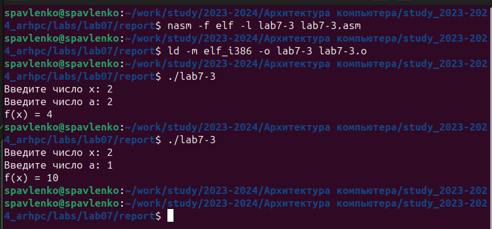

---
## Front matter
title: "Лабораторная работа №7"
subtitle: "Команды безусловного и условного переходов в NASM. Программирование ветвлений"
author: "Павленко Сергей"

## Generic otions
lang: ru-RU
toc-title: "Содержание"

## Bibliography
bibliography: bib/cite.bib
csl: pandoc/csl/gost-r-7-0-5-2008-numeric.csl

## Pdf output format
toc: true # Table of contents
toc-depth: 2
lof: true # List of figures
lot: true # List of tables
fontsize: 12pt
linestretch: 1.5
papersize: a4
documentclass: scrreprt
## I18n polyglossia
polyglossia-lang:
  name: russian
  options:
	- spelling=modern
	- babelshorthands=true
polyglossia-otherlangs:
  name: english
## I18n babel
babel-lang: russian
babel-otherlangs: english
## Fonts
mainfont: PT Serif
romanfont: PT Serif
sansfont: PT Sans
monofont: PT Mono
mainfontoptions: Ligatures=TeX
romanfontoptions: Ligatures=TeX
sansfontoptions: Ligatures=TeX,Scale=MatchLowercase
monofontoptions: Scale=MatchLowercase,Scale=0.9
## Biblatex
biblatex: true
biblio-style: "gost-numeric"
biblatexoptions:
  - parentracker=true
  - backend=biber
  - hyperref=auto
  - language=auto
  - autolang=other*
  - citestyle=gost-numeric
## Pandoc-crossref LaTeX customization
figureTitle: "Рис."
tableTitle: "Таблица"
listingTitle: "Листинг"
lofTitle: "Список иллюстраций"
lotTitle: "Список таблиц"
lolTitle: "Листинги"
## Misc options
indent: true
header-includes:
  - \usepackage{indentfirst}
  - \usepackage{float} # keep figures where there are in the text
  - \floatplacement{figure}{H} # keep figures where there are in the text
---

# Цель работы

    Изучение команд условного и бесусловного переходов. Приобретение навыков написания программ с использованием переходов. Знакомство с назначением и структурой файла листинга.

# Теоретическое введение

    Для реализации ветвлений в ассемблере используются так называемые команды передачи управления или команды перехода. Можно выделить 2 типа переходов:
    * условный переход - выполнение или не выполнение перехода в определенную точку программы в зависимости от проверки условия.
    * безусловный переход - выполнение передачи управления в определенную точку программы без каких либо условий

# Выполнение лабораторной работы

1. Создайте файл lab7-1.asm, в соответствующем каталоге
touch lab7-1.asm

{#fig:01 width=70%}

2. Инструкция jmp в NASM используется для реализации безусловных переходов. Рассмотрим пример программы с использованием инструкции jmp. Введите в файл lab7-1.asm текст программы из листинга 7.1.
Создайте исполняемый файл и запустите его.

{#fig:02 width=70%}

Измените текст программы в соответствии с листингом 7.2.
Создайте исполняемый файл и проверьте его работу.

{#fig:03 width=70%}

Измените текст программы добавив или изменив инструкции jmp, чтобы вывод програм-
мы был следующим:
user@dk4n31:~$ ./lab7-1
Сообщение № 3
Сообщение № 2
Сообщение № 1
user@dk4n31:~$

{#fig:04 width=70%}

3. Использование инструкции jmp приводит к переходу в любом случае. Однако, часто при написании программ необходимо использовать условные переходы, т.е. переход должен происходить если выполнено какое-либо условие. В качестве примера рассмотрим программу, которая определяет и выводит на экран наибольшую из 3 целочисленных переменных: A,B и C. Значения для A и C задаются в программе, значение B вводиться с клавиатуры.
Создайте файл lab7-2.asm в каталоге ~/work/arch-pc/lab07. Внимательно изучите текст
программы из листинга 7.3 и введите в lab7-2.asm.
Создайте исполняемый файл и проверьте его работу.

{#fig:05 width=70%}

4. Обычно nasm создаёт в результате ассемблирования только объектный файл. Получить файл листинга можно, указав ключ -l и задав имя файла листинга в командной строке.
Создайте файл листинга для программы из файла lab7-2.asm
nasm -f elf -l lab7-2.lst lab7-2.asm
Откройте файл листинга lab7-2.lst с помощью любого текстового редактора, например mcedit:
mcedit lab7-2.lst

{#fig:06 width=70%}

Внимательно ознакомиться с его форматом и содержимым. Подробно объяснить содержимое трёх строк файла листинга по выбору.
Откройте файл с программой lab7-2.asm и в любой инструкции с двумя операндами удалить один операнд. Выполните трансляцию с получением файла листинга:
nasm -f elf -l lab7-2.lst lab7-2.asm
Какие выходные файлы создаются в этом случае? Что добавляется в листинге?

A dd '20' - присваивает переменной А значение '20'
jg check_B - при а>c происходит переход на метку
%include 'in_out.asm' - подключение внешнего файла, для упрощения хода работы

{#fig:07 width=70%}

# Выводы

Таким образом, мы ознакомились с реализацией переходов, изучили структуры файлов листинга, научились находить наибольшее/наименьшее 

# Задание для самостоятельной работы

1. Напишите программу нахождения наименьшей из 3 целочисленных переменных a,b и c.
Значения переменных выбрать из табл. 7.5 в соответствии с вариантом, полученным при выполнении лабораторной работы № 7. Создайте исполняемый файл и проверьте его работу.

{#fig:08 width=70%}

2. Напишите программу, которая для введенных с клавиатуры значений x и a вычисляет значение заданной функции f(x) и выводит результат вычислений. Вид функции f(x) выбрать из таблицы 7.6 вариантов заданий в соответствии с вариантом, полученным при выполнении лабораторной работы № 7. Создайте исполняемый файл и проверьте его работу для значений x и a из 7.6.

{#fig:09 width=70%}

# Выводы по самостоятельной работе

В ходе самостоятельной работы, мы усвоили, как сравнивать значения и нашли выражения f(x) при определенных условиях. 

# Список литературы{.unnumbered}

1. GDB: The GNU Project Debugger. — URL: https://www.gnu.org/software/gdb/.
2. GNU Bash Manual. — 2016. — URL: https://www.gnu.org/software/bash/manual/.
3. Midnight Commander Development Center. — 2021. — URL: https://midnight-commander.
org/.
4. NASM Assembly Language Tutorials. — 2021. — URL: https://asmtutor.com/.
5. Newham C. Learning the bash Shell: Unix Shell Programming. — O’Reilly Media, 2005. —
354 с. — (In a Nutshell). — ISBN 0596009658. — URL: http://www.amazon.com/Learning-
bash-Shell-Programming-Nutshell/dp/0596009658.
6. Robbins A. Bash Pocket Reference. — O’Reilly Media, 2016. — 156 с. — ISBN 978-1491941591.
7. The NASM documentation. — 2021. — URL: https://www.nasm.us/docs.php.
8. Zarrelli G. Mastering Bash. — Packt Publishing, 2017. — 502 с. — ISBN 9781784396879.
9. Колдаев В. Д., Лупин С. А. Архитектура ЭВМ. — М. : Форум, 2018.
10. Куляс О. Л., Никитин К. А. Курс программирования на ASSEMBLER. — М. : Солон-Пресс,
2017.
11. Новожилов О. П. Архитектура ЭВМ и систем. — М. : Юрайт, 2016.
12. Расширенный ассемблер: NASM. — 2021. — URL: https://www.opennet.ru/docs/RUS/nasm/.
13. Робачевский А., Немнюгин С., Стесик О. Операционная система UNIX. — 2-е изд. — БХВ-
Петербург, 2010. — 656 с. — ISBN 978-5-94157-538-1.
14. Столяров А. Программирование на языке ассемблера NASM для ОС Unix. — 2-е изд. —
М. : МАКС Пресс, 2011. — URL: http://www.stolyarov.info/books/asm_unix.
15. Таненбаум Э. Архитектура компьютера. — 6-е изд. — СПб. : Питер, 2013. — 874 с. —
(Классика Computer Science).
16. Таненбаум Э., Бос Х. Современные операционные системы. — 4-е изд. — СПб. : Питер, 2015. — 1120 с. — (Классика Computer Science).
