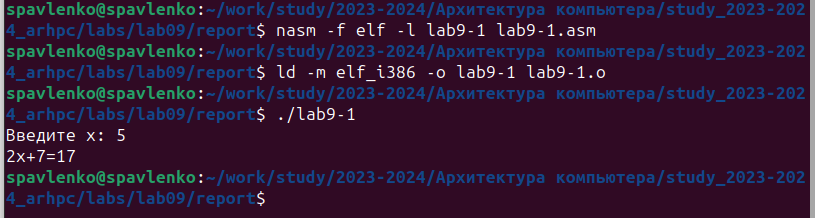

---
## Front matter
title: "Лабораторная работа №9."
subtitle: "Понятие подпрограммы.
Отладчик GDB"
author: "Павленко Сергей"

## Generic otions
lang: ru-RU
toc-title: "Содержание"

## Bibliography
bibliography: bib/cite.bib
csl: pandoc/csl/gost-r-7-0-5-2008-numeric.csl

## Pdf output format
toc: true # Table of contents
toc-depth: 2
lof: true # List of figures
lot: true # List of tables
fontsize: 12pt
linestretch: 1.5
papersize: a4
documentclass: scrreprt
## I18n polyglossia
polyglossia-lang:
  name: russian
  options:
	- spelling=modern
	- babelshorthands=true
polyglossia-otherlangs:
  name: english
## I18n babel
babel-lang: russian
babel-otherlangs: english
## Fonts
mainfont: PT Serif
romanfont: PT Serif
sansfont: PT Sans
monofont: PT Mono
mainfontoptions: Ligatures=TeX
romanfontoptions: Ligatures=TeX
sansfontoptions: Ligatures=TeX,Scale=MatchLowercase
monofontoptions: Scale=MatchLowercase,Scale=0.9
## Biblatex
biblatex: true
biblio-style: "gost-numeric"
biblatexoptions:
  - parentracker=true
  - backend=biber
  - hyperref=auto
  - language=auto
  - autolang=other*
  - citestyle=gost-numeric
## Pandoc-crossref LaTeX customization
figureTitle: "Рис."
tableTitle: "Таблица"
listingTitle: "Листинг"
lofTitle: "Список иллюстраций"
lotTitle: "Список таблиц"
lolTitle: "Листинги"
## Misc options
indent: true
header-includes:
  - \usepackage{indentfirst}
  - \usepackage{float} # keep figures where there are in the text
  - \floatplacement{figure}{H} # keep figures where there are in the text
---

# Цель работы

Приобретение навыков написания программ с использованием подпрограмм. Знакомство
с методами отладки при помощи GDB и его основными возможностями

# Теоретическое введение

Отладка — это процесс поиска и исправления ошибок в программе. В общем случае его можно разделить на четыре этапа:
* обнаружение ошибки
* поиск её местонахождения
* определение причины ошибки
* исправление ошибки
Можно выделить следующие типы ошибок:
* синтаксические ошибки — обнаруживаются во время трансляции исходного кода и вызваны нарушением ожидаемой формы или структуры языка;
* семантические ошибки — являются логическими и приводят к тому, что программа
запускается, отрабатывает, но не даёт желаемого результата
* ошибки в процессе выполнения — не обнаруживаются при трансляции и вызывают прерывание выполнения программы (например, это ошибки, связанные с переполнением
или делением на ноль).
Второй этап — поиск местонахождения ошибки. Некоторые ошибки обнаружить довольно трудно. Лучший способ найти место в программе, где находится ошибка, это разбить
программу на части и произвести их отладку отдельно друг от друга.
Третий этап — выяснение причины ошибки. После определения местонахождения ошибки
обычно проще определить причину неправильной работы программы.
Последний этап — исправление ошибки. После этого при повторном запуске программы, может обнаружиться следующая ошибка, и процесс отладки начнётся заново.

Наиболее часто применяют следующие методы отладки:
* создание точек контроля значений на входе и выходе участка программы (например, вывод промежуточных значений на экран — так называемые диагностические сообще-
ния);
* использование специальных программ-отладчиков.
Отладчики позволяют управлять ходом выполнения программы, контролировать и из-
менять данные. Это помогает быстрее найти место ошибки в программе и ускорить её
исправление. Наиболее популярные способы работы с отладчиком — это использование
точек останова и выполнение программы по шагам.
Пошаговое выполнение — это выполнение программы с остановкой после каждой строчки,
чтобы программист мог проверить значения переменных и выполнить другие действия.
Точки останова — это специально отмеченные места в программе, в которых программа-
отладчик приостанавливает выполнение программы и ждёт команд. Наиболее популярные
виды точек останова:
* Breakpoint — точка останова (остановка происходит, когда выполнение доходит до
определённой строки, адреса или процедуры, отмеченной программистом);
* Watchpoint — точка просмотра (выполнение программы приостанавливается, если
программа обратилась к определённой переменной: либо считала её значение, либо
изменила его).
Точки останова устанавливаются в отладчике на время сеанса работы с кодом програм-
мы, т.е. они сохраняются до выхода из программы-отладчика или до смены отлаживаемой
программы.

# Выполнение лабораторной работы

1. Создайте каталог для выполнения лабораторной работы № 9, перейдите в него и создайте файл lab09-1.asm:

cd ~/work/arch-pc/lab09
touch lab09-1.asm

{#fig:001 width=70%}

2. В качестве примера рассмотрим программу вычисления арифметического выражения
f(x) = 2x + 7 с помощью подпрограммы _calcul. В данном примере x вводится с
клавиатуры, а само выражение вычисляется в подпрограмме. Внимательно изучите
текст программы (Листинг 9.1)
Введите в файл lab09-1.asm текст программы из листинга 9.1. Создайте исполняемый
файл и проверьте его работу

{#fig:002 width=70%}

3. Измените текст программы, добавив подпрограмму _subcalcul в подпрограмму _calcul,
для вычисления выражения f(g(x)), где x вводится с клавиатуры, f(x) = 2x + 7, g(x) =
3x − 1. Т.е. x передается в подпрограмму _calcul из нее в подпрограмму _subcalcul, где
вычисляется выражение g(x), результат возвращается в _calcul и вычисляется выражение
f(g(x)). Результат возвращается в основную программу для вывода результата на экран.

{#fig:003 width=70%}

4. Создайте файл lab09-2.asm с текстом программы из Листинга 9.2. (Программа печати
сообщения Hello world!):
Получите исполняемый файл. Для работы с GDB в исполняемый файл необходимо добавить
отладочную информацию, для этого трансляцию программ необходимо проводить с ключом
‘-g’.
nasm -f elf -g -l lab09-2.lst lab09-2.asm
ld -m elf_i386 -o lab09-2 lab09-2.o
Проверьте работу программы, запустив ее в оболочке GDB с помощью команды run (со-
кращённо r):
(gdb) run

{#fig:004 width=70%}

5. Для более подробного анализа программы установите брейкпоинт на метку _start, с
которой начинается выполнение любой ассемблерной программы, и запустите её.
(gdb) break _start
Breakpoint 1 at 0x8049000: file lab09-2.asm, line 12.
(gdb) run
Starting program: ~/work/arch-pc/lab09/lab09-2
Breakpoint 1, _start () at lab09-2.asm:12
12 mov eax, 4
Посмотрите дисассимилированный код программы с помощью команды disassemble
начиная с метки _start
(gdb) disassemble _start
Переключитесь на отображение команд с Intel’овским синтаксисом, введя команду set
disassembly-flavor intel
(gdb) set disassembly-flavor intel
(gdb) disassemble _start

{#fig:005 width=70%}

6. Перечислите различия отображения синтаксиса машинных команд в режимах ATT и Intel.
Включите режим псевдографики для более удобного анализа программы (рис. 9.2):
(gdb) layout asm
(gdb) layout regs
В этом режиме есть три окна:
* В верхней части видны названия регистров и их текущие значения;
* В средней части виден результат дисассимилирования программы;
* Нижняя часть доступна для ввода команд.

{#fig:006 width=70%}

7. На предыдущих шагах была установлена точка останова по имени метки (_start). Проверьте это с помощью команды info breakpoints (кратко i b): 
(gdb) info breakpoints
Установим еще одну точку останова по адресу инструкции. Адрес инструкции можно
увидеть в средней части экрана в левом столбце соответствующей инструкции (см. рис. 9.3).
Определите адрес предпоследней инструкции (mov ebx,0x0) и установите точку останова.
(gdb) break *<адрес>
Посмотрите информацию о всех установленных точках останова
Установим еще одну точку останова по адресу инструкции. Адрес инструкции можно
увидеть в средней части экрана в левом столбце соответствующей инструкции (см. рис. 9.3).
Определите адрес предпоследней инструкции (mov ebx,0x0) и установите точку останова.
(gdb) break *<адрес>
Посмотрите информацию о всех установленных точках останова:
(gdb) i b

{#fig:007 width=70%}

{#fig:008 width=70%}

8. Отладчик может показывать содержимое ячеек памяти и регистров, а при необходимости
позволяет вручную изменять значения регистров и переменных.
Выполните 5 инструкций с помощью команды stepi (или si) и проследите за изменением
значений регистров. Значения каких регистров изменяются?
Посмотреть содержимое регистров также можно с помощью команды info registers
(или i r).
(gdb) info registers

{#fig:009 width=70%}

9. С помощью команды x &<имя переменной> также можно посмотреть содержимое пере-
менной.
Посмотрите значение переменной msg1 по имени
(gdb) x/1sb &msg1
0x804a000 <msg1>: "Hello, "
Посмотрите значение переменной msg2 по адресу. Адрес переменной можно определить
по дизассемблированной инструкции. Посмотрите инструкцию mov ecx,msg2 которая записывает в регистр ecx адрес перемененной msg2

{#fig:010 width=70%}

10. Изменить значение для регистра или ячейки памяти можно с помощью команды set,
задав ей в качестве аргумента имя регистра или адрес. При этом перед именем регистра
ставится префикс $, а перед адресом нужно указать в фигурных скобках тип данных (размер сохраняемого значения; в качестве типа данных можно использовать типы языка Си).
Измените первый символ переменной msg1:
(gdb) set {char}msg1='h'
(gdb) x/1sb &msg1
0x804a000 <msg1>: "hello, "
(gdb)

{#fig:011 width=70%}

11. Замените любой символ во второй переменной msg2.

{#fig:012 width=70%}

12. Чтобы посмотреть значения регистров используется команда print /F <val> (перед именем регистра обязательно ставится префикс $)
p/F $<регистр>

{#fig:013 width=70%}

13. С помощью команды set измените значение регистра ebx:
(gdb) set $ebx='2'
(gdb) p/s $ebx
$3 = 50
(gdb) set $ebx=2
(gdb) p/s $ebx
$4 = 2
(gdb)

{#fig:014 width=70%}

14. Объясните разницу вывода команд p/s $ebx.
Обе команды делают одно и тоже - устанавливают значение переменной равным 2, однако в первом случае значение указывается внутри кавычек, что может быть полезно, если нужно установить значение переменной, которое содержит пробелы или специальные символы.
Завершите выполнение программы с помощью команды continue (сокращенно c) или
stepi (сокращенно si) и выйдите из GDB с помощью команды quit (сокращенно q)

{#fig:015 width=70%}

{#fig:016 width=70%}

15. Скопируйте файл lab8-2.asm, созданный при выполнении лабораторной работы №8,
с программой выводящей на экран аргументы командной строки (Листинг 8.2) в файл с
именем lab09-3.asm:
cp ~/work/arch-pc/lab08/lab8-2.asm ~/work/arch-pc/lab09/lab09-3.asm
Создайте исполняемый файл.
nasm -f elf -g -l lab09-3.lst lab09-3.asm
ld -m elf_i386 -o lab09-3 lab09-3.o
Для загрузки в gdb программы с аргументами необходимо использовать ключ --args.
Загрузите исполняемый файл в отладчик, указав аргументы:
gdb --args lab09-3 аргумент1 аргумент 2 'аргумент 3'

{#fig:017 width=70%}

16. Для начала установим точку останова перед первой инструкцией в программе и запустим
ее.
(gdb) b _start
(gdb) run
Адрес вершины стека храниться в регистре esp и по этому адресу располагается число
равное количеству аргументов командной строки (включая имя программы):
(gdb) x/x $esp
0xffffd200: 0x05

{#fig:018 width=70%}

17. Посмотрите остальные позиции стека – по адесу [esp+4] располагается адрес в памяти
где находиться имя программы, по адесу [esp+8] храниться адрес первого аргумента, по
адресу [esp+12] – второго и т.д.
110 Демидова А. В.
Архитектура ЭВМ
(gdb) x/s *(void**)($esp + 4)
0xffffd358: "~/lab09-3"
(gdb) x/s *(void**)($esp + 8)
0xffffd3bc: "аргумент1"
(gdb) x/s *(void**)($esp + 12)
0xffffd3ce: "аргумент"
(gdb) x/s *(void**)($esp + 16)
0xffffd3df: "2"
(gdb) x/s *(void**)($esp + 20)
0xffffd3e1: "аргумент 3"
(gdb) x/s *(void**)($esp + 24)
0x0: <error: Cannot access memory at address 0x0>
(gdb)

{#fig:019 width=70%}

Объясните, почему шаг изменения адреса равен 4 ([esp+4], [esp+8], [esp+12] и т.д.). 
Это может зависеть от разрядности процессора, архитектуры ОС и других факторов. Однако в х86 архитектуре процессоры используют систему адресации, которая предпологает, что каждый байт в памяти имеет адрес, кратный 4.

# Выводы

Таким образом мы приобрели навыкы написания программ с использованием подпрограмм. Познакомились
с методами отладки при помощи GDB и его основными возможностями

# Самостоятельная работа

1. Преобразуйте программу из лабораторной работы №8 (Задание №1 для самостоятель-
ной работы), реализовав вычисление значения функции f(x) как подпрограмму.

{#fig:020 width=70%}

2. В листинге 9.3 приведена программа вычисления выражения (3 + 2) * 4 + 5. При запуске
данная программа дает неверный результат. 

{#fig:021 width=70%}

Проверьте это. С помощью отладчика GDB,
анализируя изменения значений регистров, определите ошибку и исправьте ее.

{#fig:022 width=70%}

# Выводы по самостоятельной работе

Таким образом в ходе самостоятельной работы мы закрепили знания по данной теме на практике

# Список литературы{.unnumbered}

1. GDB: The GNU Project Debugger. — URL: https://www.gnu.org/software/gdb/.
2. GNU Bash Manual. — 2016. — URL: https://www.gnu.org/software/bash/manual/.
3. Midnight Commander Development Center. — 2021. — URL: https://midnight-commander.
org/.
4. NASM Assembly Language Tutorials. — 2021. — URL: https://asmtutor.com/.
5. Newham C. Learning the bash Shell: Unix Shell Programming. — O’Reilly Media, 2005. —
354 с. — (In a Nutshell). — ISBN 0596009658. — URL: http://www.amazon.com/Learning-
bash-Shell-Programming-Nutshell/dp/0596009658.
6. Robbins A. Bash Pocket Reference. — O’Reilly Media, 2016. — 156 с. — ISBN 978-1491941591.
7. The NASM documentation. — 2021. — URL: https://www.nasm.us/docs.php.
8. Zarrelli G. Mastering Bash. — Packt Publishing, 2017. — 502 с. — ISBN 9781784396879.
9. Колдаев В. Д., Лупин С. А. Архитектура ЭВМ. — М. : Форум, 2018.
10. Куляс О. Л., Никитин К. А. Курс программирования на ASSEMBLER. — М. : Солон-Пресс,
2017.
11. Новожилов О. П. Архитектура ЭВМ и систем. — М. : Юрайт, 2016.
12. Расширенный ассемблер: NASM. — 2021. — URL: https://www.opennet.ru/docs/RUS/nasm/.
13. Робачевский А., Немнюгин С., Стесик О. Операционная система UNIX. — 2-е изд. — БХВ-
Петербург, 2010. — 656 с. — ISBN 978-5-94157-538-1.
14. Столяров А. Программирование на языке ассемблера NASM для ОС Unix. — 2-е изд. —
М. : МАКС Пресс, 2011. — URL: http://www.stolyarov.info/books/asm_unix.
15. Таненбаум Э. Архитектура компьютера. — 6-е изд. — СПб. : Питер, 2013. — 874 с. —
(Классика Computer Science).
16. Таненбаум Э., Бос Х. Современные операционные системы. — 4-е изд. — СПб. : Питер, 2015. — 1120 с. — (Классика Computer Science).
