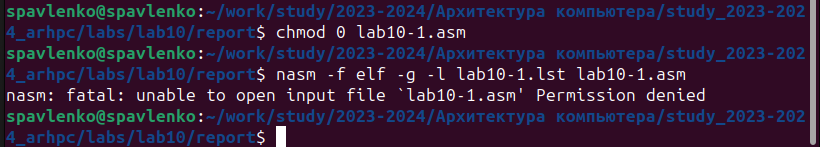

---
## Front matter
title: "Лабораторная работа №10."
subtitle: "Работа с файлами средствами Nasm"
author: "Павленко Сергей"

## Generic otions
lang: ru-RU
toc-title: "Содержание"

## Bibliography
bibliography: bib/cite.bib
csl: pandoc/csl/gost-r-7-0-5-2008-numeric.csl

## Pdf output format
toc: true # Table of contents
toc-depth: 2
lof: true # List of figures
lot: true # List of tables
fontsize: 12pt
linestretch: 1.5
papersize: a4
documentclass: scrreprt
## I18n polyglossia
polyglossia-lang:
  name: russian
  options:
	- spelling=modern
	- babelshorthands=true
polyglossia-otherlangs:
  name: english
## I18n babel
babel-lang: russian
babel-otherlangs: english
## Fonts
mainfont: PT Serif
romanfont: PT Serif
sansfont: PT Sans
monofont: PT Mono
mainfontoptions: Ligatures=TeX
romanfontoptions: Ligatures=TeX
sansfontoptions: Ligatures=TeX,Scale=MatchLowercase
monofontoptions: Scale=MatchLowercase,Scale=0.9
## Biblatex
biblatex: true
biblio-style: "gost-numeric"
biblatexoptions:
  - parentracker=true
  - backend=biber
  - hyperref=auto
  - language=auto
  - autolang=other*
  - citestyle=gost-numeric
## Pandoc-crossref LaTeX customization
figureTitle: "Рис."
tableTitle: "Таблица"
listingTitle: "Листинг"
lofTitle: "Список иллюстраций"
lotTitle: "Список таблиц"
lolTitle: "Листинги"
## Misc options
indent: true
header-includes:
  - \usepackage{indentfirst}
  - \usepackage{float} # keep figures where there are in the text
  - \floatplacement{figure}{H} # keep figures where there are in the text
---

# Цель работы

Приобретение навыков написания программ для работы с файлами

# Теоретическое введение

ОС GNU/Linux является многопользовательской операционной системой. И для обеспече-
ния защиты данных одного пользователя от действий других пользователей существуют
специальные механизмы разграничения доступа к файлам. Кроме ограничения доступа, дан-
ный механизм позволяет разрешить другим пользователям доступ данным для совместной
работы.
Права доступа определяют набор действий (чтение, запись, выполнение), разрешённых
для выполнения пользователям системы над файлами. Для каждого файла пользователь
может входить в одну из трех групп: владелец, член группы владельца, все остальные. Для
каждой из этих групп может быть установлен свой набор прав доступа. Владельцем файла
является его создатель. Для предоставления прав доступа другому пользователю или другой
группе командой
chown [ключи] <новый_пользователь>[:новая_группа] <файл>
или
chgrp [ключи] < новая_группа > <файл>
Набор прав доступа задается тройками битов и состоит из прав на чтение, запись и ис-
полнение файла. В символьном представлении он имеет вид строк rwx, где вместо любого
символа может стоять дефис. Всего возможно 8 комбинаций, приведенных в таблице 10.1.
Буква означает наличие права (установлен в единицу второй бит триады r — чтение, первый
бит w — запись, нулевой бит х — исполнение), а дефис означает отсутствие права (нулевое
значение соответствующего бита). Также права доступа могут быть представлены как вось-
меричное число. Так, права доступа rw- (чтение и запись, без исполнения) понимаются как
три двоичные цифры 110 или как восьмеричная цифра 6

Полная строка прав доступа в символьном представлении имеет вид:
<права_владельца> <права_группы> <права_остальных>
Так, например, права rwx r-x --x выглядят как двоичное число 111 101 001, или вось-
меричное 751.
Свойства (атрибуты) файлов и каталогов можно вывести на терминал с помощью команды
ls с ключом -l. Так например, чтобы узнать права доступа к файлу README можно узнать с
помощью следующей команды:
$ls -l /home/debugger/README
-rwxr-xr-- 1 debugger users 0 Feb 14 19:08 /home/debugger/README
В первой колонке показаны текущие права доступа, далее указан владелец файла и группа:
Тип файла определяется первой позицией, это может быть: каталог — d, обычный файл
— дефис (-) или символьная ссылка на другой файл — l. Следующие 3 набора по 3 символа
определяют конкретные права для конкретных групп: r — разрешено чтение файла, w —
разрешена запись в файл; x — разрешено исполнение файл и дефис (-) — право не дано.
Для изменения прав доступа служит команда chmod, которая понимает как символьное,
так и числовое указание прав. Для того чтобы назначить файлу /home/debugger/README
права rw-r, то есть разрешить владельцу чтение и запись, группе только чтение, остальным
пользователям — ничего:
$chmod 640 README # 110 100 000 == 640 == rw-r-----
$ls -l README
-rw-r 1 debugger users 0 Feb 14 19:08 /home/debugger/README
В символьном представлении есть возможность явно указывать какой группе какие права
необходимо добавить, отнять или присвоить. Например, чтобы добавить право на исполне-
ние файла README группе и всем остальным:
$chmod go+x README
$ls -l README
-rw-r-x--x 1 debugger users 0 Feb 14 19:08 /home/debugger/README
Формат символьного режима:
chmod <категория><действие><набор_прав><файл>

# Выполнение лабораторной работы

1. Создайте каталог для программам лабораторной работы № 10, перейдите в него и
создайте файлы lab10-1.asm, readme-1.txt и readme-2.txt:
mkdir ~/work/arch-pc/lab09
cd ~/work/arch-pc/lab09
touch lab10-1.asm readme-1.txt readme-2.txt

{#fig:001 width=70%}

2. Введите в файл lab10-1.asm текст программы из листинга 10.1 (Программа записи в
файл сообщения). Создайте исполняемый файл и проверьте его работу.

{#fig:002 width=70%}

3. С помощью команды chmod измените права доступа к исполняемому файлу lab10-1,
запретив его выполнение. Попытайтесь выполнить файл. Объясните результат
Таким образом, командой chmod 0 lab10-1.asm , мы ограничили доступ к файлу, следовательно запретив его выполнение

{#fig:003 width=70%}

4. С помощью команды chmod измените права доступа к файлу lab10-1.asm с исходным
текстом программы, добавив права на исполнение. Попытайтесь выполнить его и
объясните результат.
chmod 755 lab10-1.asm - предоставляет владельцу полные права, а остальным пользователям право только на чтение и выполнение.

{#fig:004 width=70%}

5. В соответствии с вариантом в таблице 10.4 предоставить права доступа к файлу readme-
1.txt представленные в символьном виде, а для файла readme-2.txt – в двочном виде.
Проверить правильность выполнения с помощью команды ls -l

{#fig:005 width=70%}

{#fig:006 width=70%}

{#fig:007 width=70%}

{#fig:008 width=70%}

{#fig:009 width=70%}

{#fig:0010 width=70%}

# Выводы

Таким образом, мы изучили навыки написания программ для работы с файлами.

# Задание для самостоятельной работы

1. Напишите программу работающую по следующему алгоритму:
* Вывод приглашения “Как Вас зовут?”
* ввести с клавиатуры свои фамилию и имя
* создать файл с именем name.txt
* записать в файл сообщение “Меня зовут”
* дописать в файл строку введенную с клавиатуры
* закрыть файл

{#fig:0011 width=70%}

# Выводы

В ходе выполнения самостоятельной работы, мы усвоили на практике знания по теме Работа с файлами средствами Nasm и выполнили программу по алгоритму.

# Список литературы{.unnumbered}

1. GDB: The GNU Project Debugger. — URL: https://www.gnu.org/software/gdb/.
2. GNU Bash Manual. — 2016. — URL: https://www.gnu.org/software/bash/manual/.
3. Midnight Commander Development Center. — 2021. — URL: https://midnight-commander.
org/.
4. NASM Assembly Language Tutorials. — 2021. — URL: https://asmtutor.com/.
5. Newham C. Learning the bash Shell: Unix Shell Programming. — O’Reilly Media, 2005. —
354 с. — (In a Nutshell). — ISBN 0596009658. — URL: http://www.amazon.com/Learning-
bash-Shell-Programming-Nutshell/dp/0596009658.
6. Robbins A. Bash Pocket Reference. — O’Reilly Media, 2016. — 156 с. — ISBN 978-1491941591.
7. The NASM documentation. — 2021. — URL: https://www.nasm.us/docs.php.
8. Zarrelli G. Mastering Bash. — Packt Publishing, 2017. — 502 с. — ISBN 9781784396879.
9. Колдаев В. Д., Лупин С. А. Архитектура ЭВМ. — М. : Форум, 2018.
10. Куляс О. Л., Никитин К. А. Курс программирования на ASSEMBLER. — М. : Солон-Пресс,
2017.
11. Новожилов О. П. Архитектура ЭВМ и систем. — М. : Юрайт, 2016.
12. Расширенный ассемблер: NASM. — 2021. — URL: https://www.opennet.ru/docs/RUS/nasm/.
13. Робачевский А., Немнюгин С., Стесик О. Операционная система UNIX. — 2-е изд. — БХВ-
Петербург, 2010. — 656 с. — ISBN 978-5-94157-538-1.
14. Столяров А. Программирование на языке ассемблера NASM для ОС Unix. — 2-е изд. —
М. : МАКС Пресс, 2011. — URL: http://www.stolyarov.info/books/asm_unix.
15. Таненбаум Э. Архитектура компьютера. — 6-е изд. — СПб. : Питер, 2013. — 874 с. —
(Классика Computer Science).
16. Таненбаум Э., Бос Х. Современные операционные системы. — 4-е изд. — СПб. : Питер, 2015. — 1120 с. — (Классика Computer Science).
